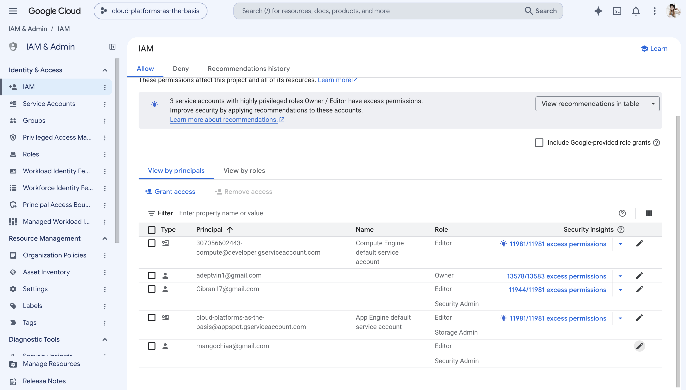
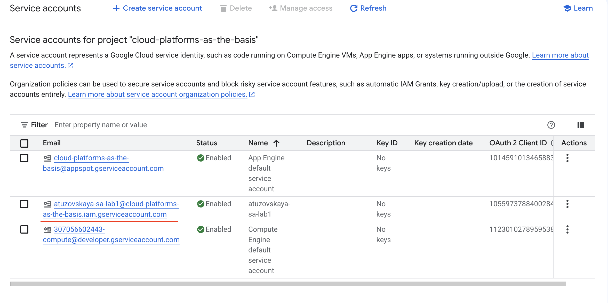
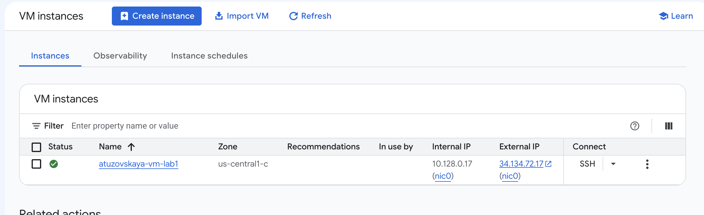
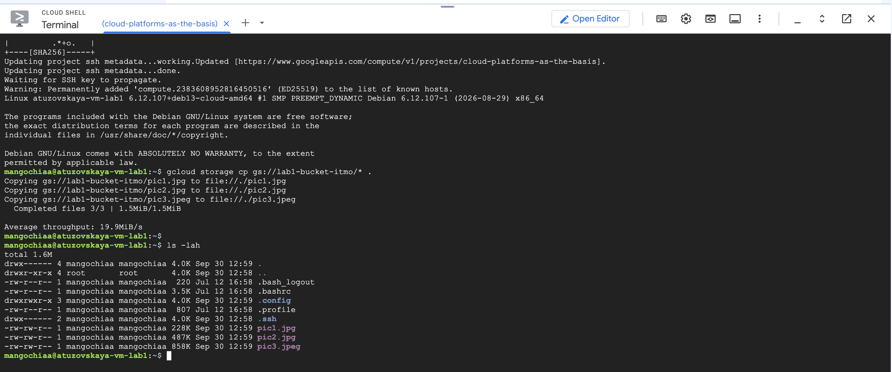
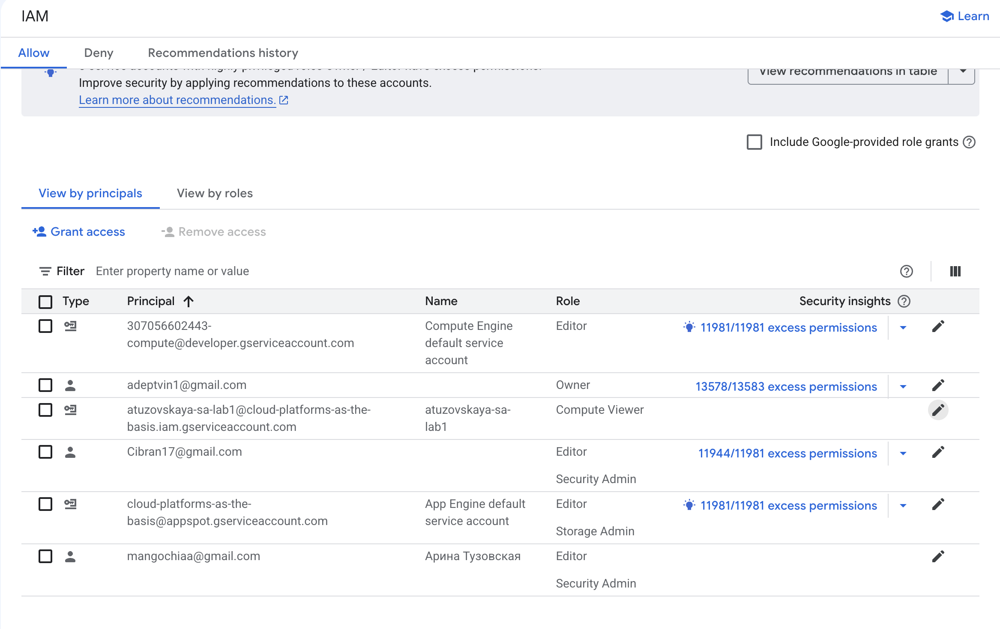
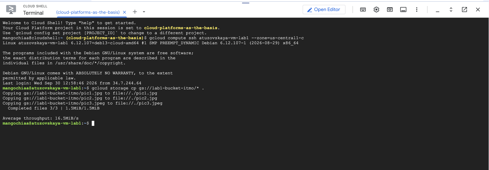
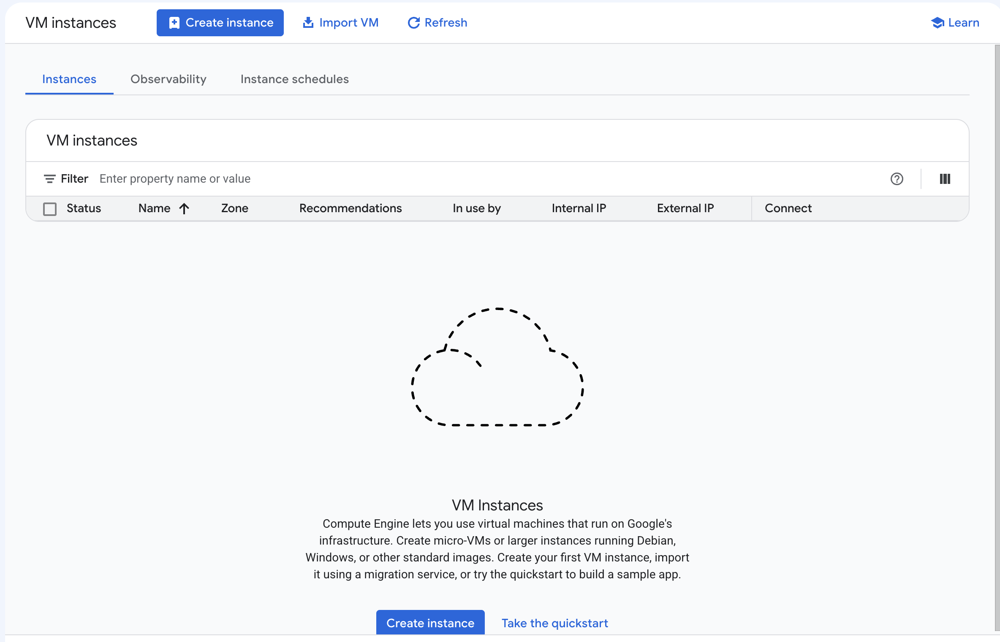

University: [ITMO University](https://itmo.ru/ru/)
Faculty: [FICT](https://fict.itmo.ru)
Course: [Cloud platforms as the basis of technology entrepreneurship](https://ex-itmo-ict-faculty.github.io/cloud-platforms-as-the-basis-of-technology-entrepreneurship/)
Year: 2026
Group: u4225
Author: Тузовская Арина Сергеевна
Lab: Lab1
Date of create: 30.09.2026
Date of finished: 30.09.2026

## Цель работы

Ознакомиться с основными возможностями и преимуществами облачной платформы Google Cloud.

## Ход работы

### 1. Получение доступа к Google Cloud

Была заполнена Google-форма для получения доступа к Google Cloud. После предоставления доступа был открыт проект `cloud-platforms-as-the-basis`.

### 2. Создание Service Account

В разделе **IAM & Admin → Service Accounts** был создан сервисный аккаунт `atuzovskaya-sa-lab1` с ролью **Storage Admin**.

### 3. Создание виртуальной машины

В разделе **Compute Engine** была создана минимальная виртуальная машина:

- **Имя:** `atuzovskaya-vm-lab1`
- **Machine type:** `e2-micro`
- **Provisioning model:** Spot
- **Firewall:** разрешён HTTP и HTTPS трафик

### 4. Копирование файлов из бакета

С помощью Cloud Shell было выполнено подключение к виртуальной машине и копирование 3 файлов из бакета `lab1-bucket-itmo`:

Команда `ls -lah` подтвердила наличие трёх файлов на VM: `pic1.jpg`, `pic2.jpg`, `pic3.jpeg`.

### 5. Изменение прав доступа и повторная проверка

Роль сервисного аккаунта `atuzovskaya-sa-lab1` была изменена с **Storage Admin** на **Compute Viewer**.

После этого была предпринята повторная попытка копирования файлов из бакета. Копирование снова прошло успешно.

### 6. Анализ результата

Успешное копирование объясняется тем, что виртуальная машина `atuzovskaya-vm-lab1` при создании использовала **Compute Engine default service account**, а не созданный мной `atuzovskaya-sa-lab1`. У стандартного сервисного аккаунта есть собственные широкие права, поэтому смена роли нашего сервисного аккаунта не повлияла на доступ к бакету.

Это показывает важность явного указания сервисного аккаунта при создании облачных ресурсов — иначе созданный аккаунт с настроенными правами не используется.

### 7. Удаление ресурсов

Все созданные ресурсы были удалены:

- Виртуальная машина `atuzovskaya-vm-lab1`
- Сервисный аккаунт `atuzovskaya-sa-lab1`

## Вывод

В ходе лабораторной работы я ознакомилась с основными сервисами Google Cloud: IAM (управление доступом), Compute Engine (виртуальные машины) и Cloud Storage (хранение данных). Я научилась создавать сервисный аккаунт и назначать ему роли (Storage Admin, Compute Viewer), создавать виртуальную машину в режиме Spot и работать с бакетом через утилиту `gcloud` из Cloud Shell.

На практике убедилась, что в облачных платформах права доступа (IAM-роли) и привязка ресурсов к конкретному сервисному аккаунту — критически важные аспекты. В моем случае смена роли не привела к ожидаемому отказу в доступе, потому что виртуальная машина использовала стандартный Compute Engine service account, а не созданный мной. Это демонстрирует принцип наименьших привилегий: при создании ресурсов важно явно указывать, какой сервисный аккаунт они используют, чтобы настроенные политики доступа реально применялись.
