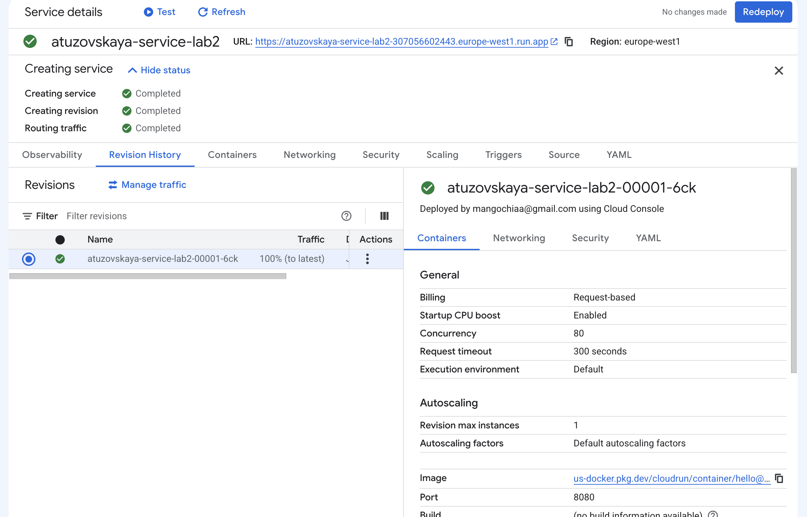
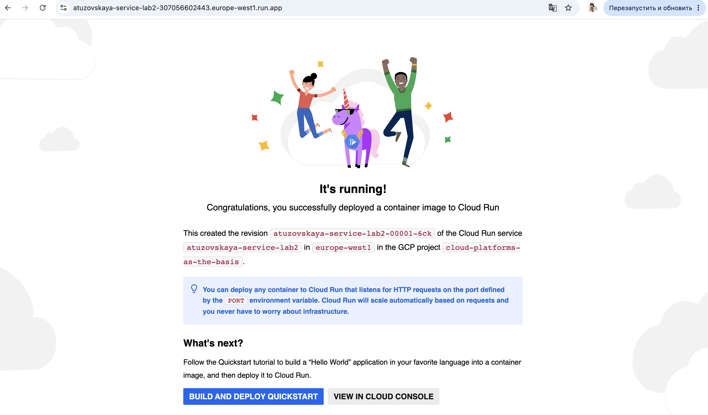
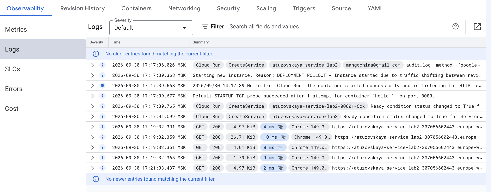
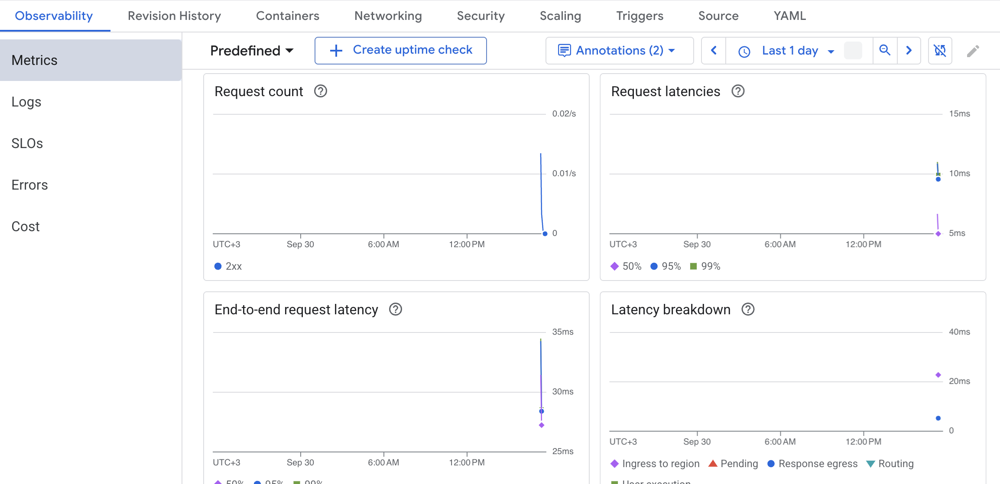
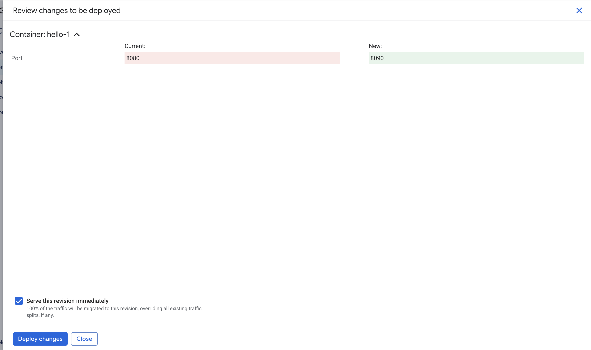
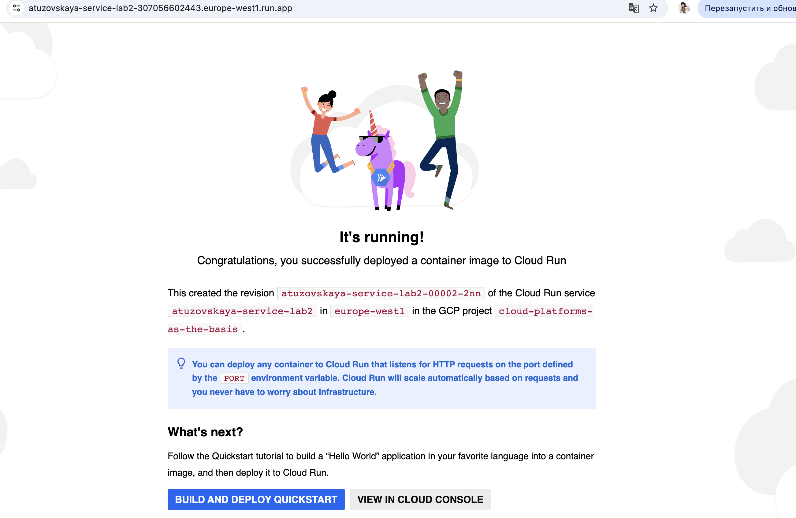
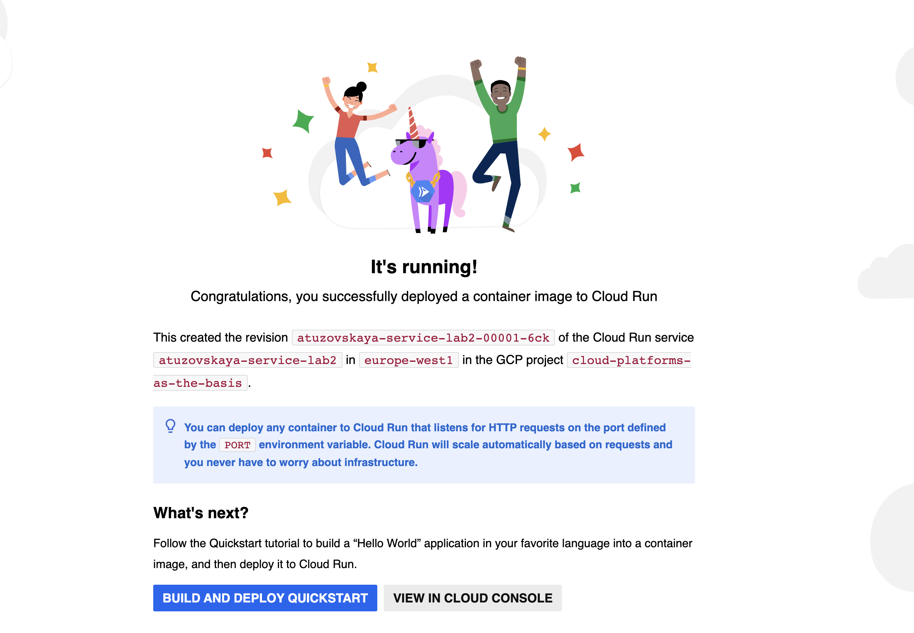
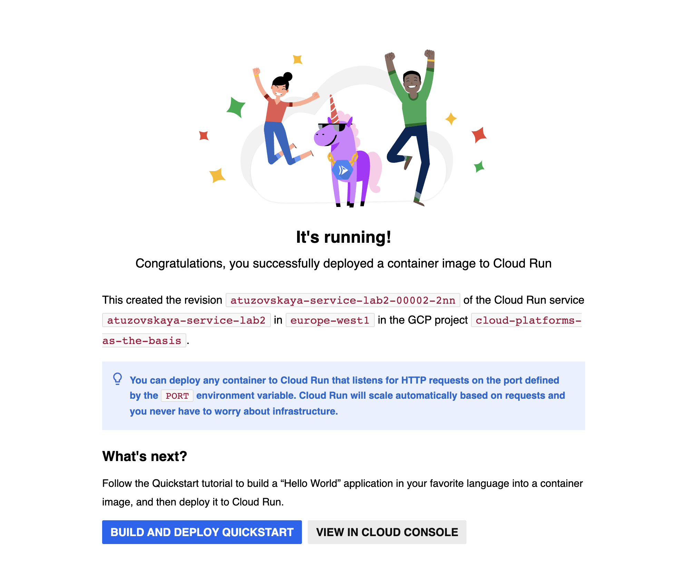
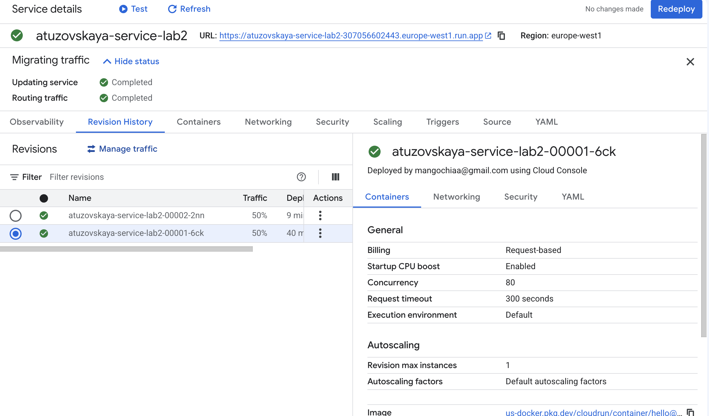
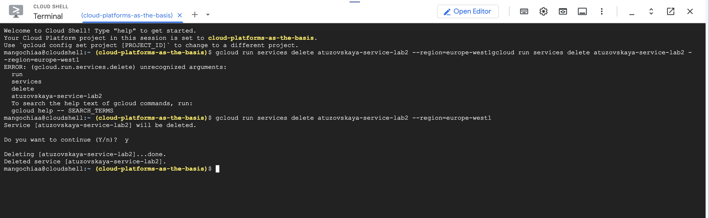

University: [ITMO University](https://itmo.ru/ru/)
Faculty: [FICT](https://fict.itmo.ru)
Course: [Cloud platforms as the basis of technology entrepreneurship](https://ex-itmo-ict-faculty.github.io/cloud-platforms-as-the-basis-of-technology-entrepreneurship/)
Year: 2026
Group: u4225
Author: Тузовская Арина Сергеевна
Lab: Lab2
Date of create: 30.09.2026
Date of finished: 30.09.2026

## Цель работы

Ознакомиться с работой Cloud Run.

## Ход работы

### 1. Создание Cloud Run сервиса

В Google Cloud Console был создан сервис Cloud Run со следующими настройками:

- **Service name:** `atuzovskaya-service-lab2`
- **Region:** `europe-west1`
- **Container image:** `us-docker.pkg.dev/cloudrun/container/hello` (стандартный Hello World)
- **Authentication:** Allow public access (публичный доступ)
- **Billing:** Request-based
- **CPU:** 1
- **Memory:** 128 MiB
- **Revision max instances:** 1

Сервис успешно развернулся, URL сервиса: `https://atuzovskaya-service-lab2-307056602443.europe-west1.run.app`

### 2. Тестирование сервиса

Сервис был протестирован путём перехода по предоставленному URL в браузере. На странице отобразилось приветственное сообщение **«It's running!»** от стандартного контейнера Hello, а также информация о созданной ревизии `atuzovskaya-service-lab2-00001-6ck`.

### 3. Анализ логов и метрик

#### Логи

В разделе **Observability → Logs** были проанализированы записи о работе сервиса. Видны записи о:

- Создании сервиса (`CreateService`)
- Запуске контейнера с сообщением: `Hello from Cloud Run! The container started successfully and is listening for HTTP requests on port 8080.`
- Успешном выполнении STARTUP TCP probe на порту 8080
- Запросах от браузера (метод GET, статус 200, время ответа ~2-10 ms)

#### Метрики

В разделе **Observability → Metrics** были проанализированы графики:

- **Request count** — количество запросов к сервису
- **Request latencies** — задержка запросов (~10 ms)
- **End-to-end request latency** — полная задержка (~30 ms)
- **Latency breakdown** — разбивка задержки по компонентам

### 4. Изменение порта на 8090

Была создана новая ревизия с изменённым портом контейнера: с `8080` на `8090`. В окне **Review changes to be deployed** видно, что Port меняется с 8080 (красным) на 8090 (зелёным).

После деплоя была создана новая ревизия `atuzovskaya-service-lab2-00002-2nn`. Вопреки ожиданиям, сервис продолжил работать. Это объясняется тем, что стандартный контейнер Hello читает порт из переменной окружения `PORT`, которую Cloud Run передаёт автоматически. Как указано в подсказке на странице сервиса: *«You can deploy any container to Cloud Run that listens for HTTP requests on the port defined by the PORT environment variable»*.

### 5. Переключение трафика между версиями

В разделе **Revision History → Manage traffic** было протестировано управление трафиком между двумя ревизиями.

**Переключение 100% трафика на ревизию 00001 (порт 8080):**

Был выбран вариант **Send all traffic to one revision** с ревизией `atuzovskaya-service-lab2-00001-6ck`. После сохранения и обновления страницы сервиса в браузере в строке «This created the revision...» отображается именно `00001-6ck`.

**Переключение 100% трафика на ревизию 00002 (порт 8090):**

Аналогично был направлен весь трафик на ревизию `atuzovskaya-service-lab2-00002-2nn`. Сервис продолжил работать — уже на новой ревизии.

**Распределение трафика 50/50:**

Был выбран вариант **Split traffic across multiple revisions** с распределением 50% на `00001-6ck` и 50% на `00002-2nn`. При многократном обновлении страницы сервиса в браузере номер ревизии на странице менялся, что подтверждает работу распределения трафика.

### 6. Удаление ресурсов

Сервис Cloud Run `atuzovskaya-service-lab2` был удалён с помощью команды в Cloud Shell:

В терминале появилось подтверждение: `Deleted service [atuzovskaya-service-lab2].`

## Вывод

В ходе лабораторной работы я ознакомилась с работой Cloud Run — сервисом для запуска контейнеризованных приложений без управления инфраструктурой.

Я научилась:
- Разворачивать сервис Cloud Run из готового контейнера с минимальными ресурсами (1 CPU, 128 MiB, max instances = 1);
- Анализировать логи и метрики через вкладку Observability;
- Изменять настройки контейнера, в частности порт;
- Управлять трафиком между ревизиями, включая распределение по процентам;
- Удалять сервис через утилиту `gcloud`.

**Ключевой вывод по смене порта:** ожидалось, что после изменения порта с 8080 на 8090 сервис перестанет отвечать. Однако стандартный контейнер Hello читает значение порта из переменной окружения `PORT`, которую Cloud Run передаёт автоматически. Поэтому сервис продолжил работу — это показывает важность правильного проектирования контейнеров: приложение должно слушать порт, определяемый переменной `PORT`, а не жёстко зашитый порт.

**Вывод по управлению трафиком:** механизм revision и traffic splitting в Cloud Run позволяет безопасно выкатывать новые версии приложения (canary-деплой) — например, направляя 10% трафика на новую ревизию и 90% на старую, чтобы убедиться в стабильности, прежде чем переключать 100% трафика на новую версию.

