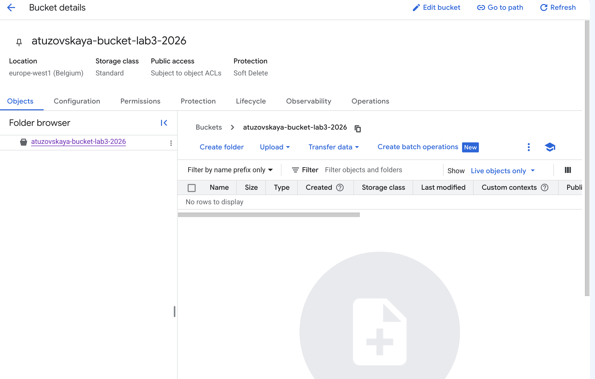
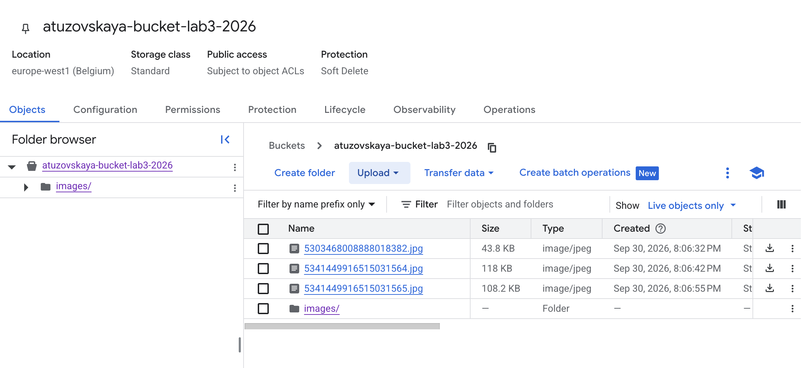
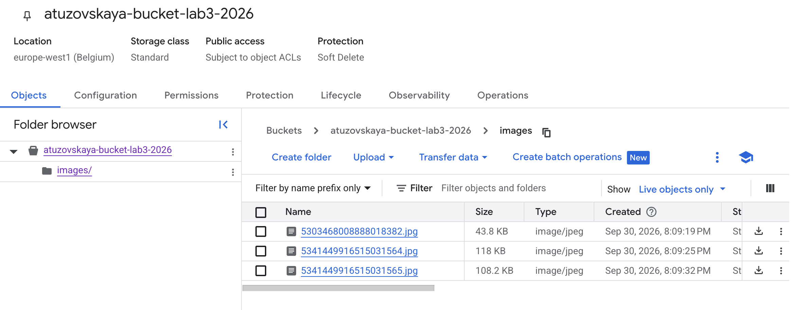
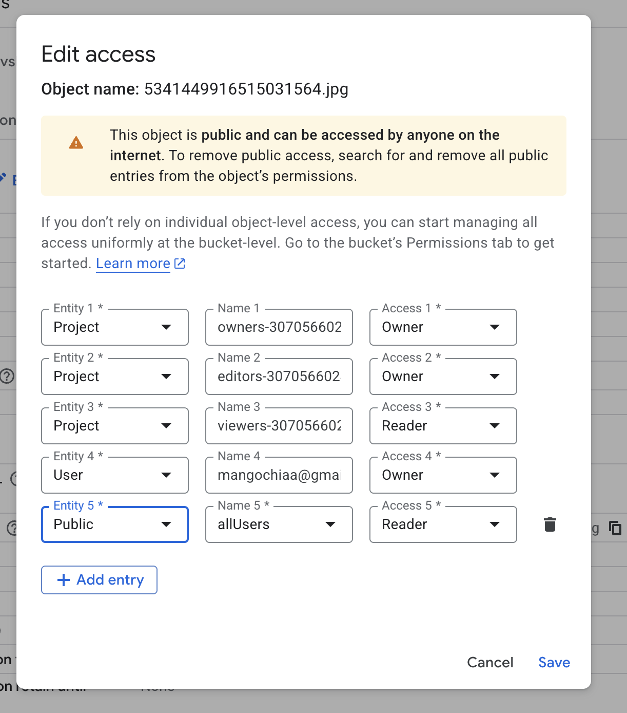
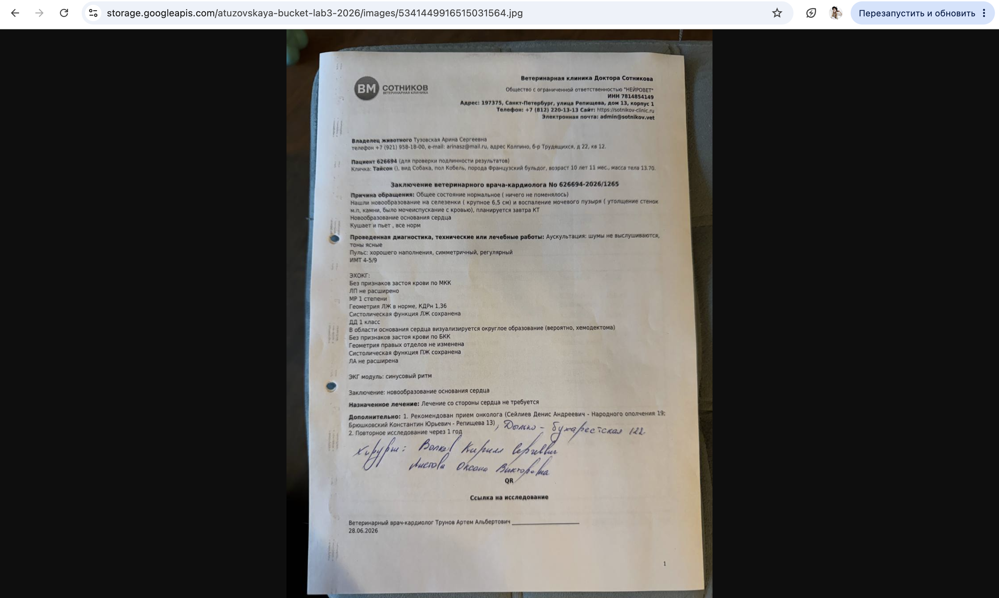
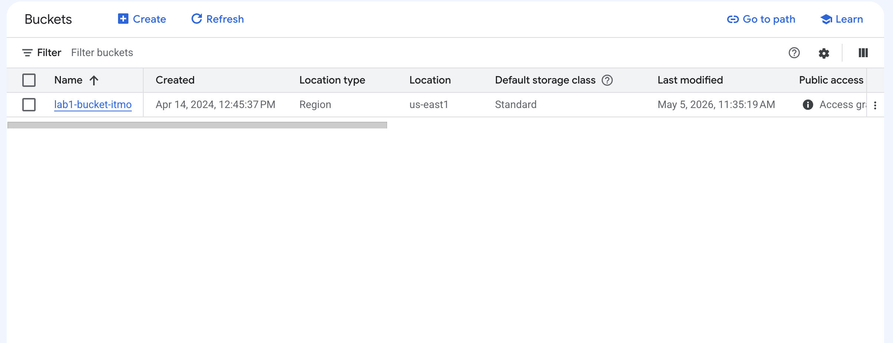

University: [ITMO University](https://itmo.ru/ru/)
Faculty: [FICT](https://fict.itmo.ru)
Course: [Cloud platforms as the basis of technology entrepreneurship](https://ex-itmo-ict-faculty.github.io/cloud-platforms-as-the-basis-of-technology-entrepreneurship/)
Year: 2026
Group: u4225
Author: Тузовская Арина Сергеевна
Lab: Lab3
Date of create: 30.09.2026
Date of finished: 30.09.2026

## Цель работы

Ознакомиться с основными понятиями и принципами работы облачного хранилища, изучить различные модели хранения данных (блок, файл, объектное хранилище), познакомиться с основными сервисами и функционалом облачных хранилищ.

## Ход работы

### 1. Создание Cloud Storage bucket

В Google Cloud Console был создан бакет Cloud Storage со следующими настройками:

- **Name:** `atuzovskaya-bucket-lab3-2026`
- **Location type:** Region
- **Region:** `europe-west1 (Belgium)`
- **Storage class:** Standard
- **Public access prevention:** Off (снята защита, чтобы можно было делать файлы публичными)
- **Access control:** Fine-grained (Subject to object ACLs)
- **Protection:** Soft Delete

### 2. Загрузка изображений

В бакет было загружено 3 изображения в формате JPEG:

- `5303468008888018382.jpg` (43.8 KB)
- `5341449916515031564.jpg` (118 KB)
- `5341449916515031565.jpg` (108.2 KB)

### 3. Создание папки и перемещение файлов

Внутри бакета была создана папка `images/`, в которую через утилиту `gcloud` в Cloud Shell были перемещены все 3 изображения: gcloud storage mv gs://atuzovskaya-bucket-lab3-2026/файл.jpg gs://atuzovskaya-bucket-lab3-2026/images/

### 4. Настройка публичного доступа

Для каждого файла в папке `images/` был открыт раздел **Edit Access**, и в качестве нового участника добавлен **Public** с ролью **Reader**. После подтверждения (Allow public access) файлы стали публично доступны.

### 5. Получение публичной ссылки на файл

После настройки публичного доступа в разделе **Overview** файла появился **Public URL** следующего вида: https://storage.googleapis.com/atuzovskaya-bucket-lab3-2026/images/5303468008888018382.jpg

Ссылка была проверена в браузере — изображение успешно открывается без авторизации.

### 6. Удаление ресурсов

После выполнения работы бакет `atuzovskaya-bucket-lab3-2026` был удалён вместе со всеми файлами. При удалении было подтверждено действие вводом слова `DELETE`.

## Вывод

В ходе лабораторной работы я ознакомилась с сервисом Cloud Storage в Google Cloud. Я изучила основные принципы работы объектного хранилища и его отличие от блочного и файлового хранения: данные хранятся в виде объектов внутри бакетов, доступ к ним осуществляется по уникальным URL, а масштабирование происходит автоматически.

Я научилась:
- Создавать Cloud Storage bucket с выбором региона, класса хранения и модели контроля доступа;
- Загружать файлы в бакет через веб-интерфейс;
- Создавать папки внутри бакета и перемещать файлы через утилиту `gcloud`;
- Настраивать публичный доступ к отдельным файлам с помощью ACL;
- Получать публичные ссылки на файлы и проверять их работу в браузере;
- Удалять бакет со всеми данными.

**Ключевой вывод:** Cloud Storage — это гибкое объектное хранилище, в котором можно тонко настраивать уровень доступа как к бакету целиком, так и к отдельным объектам. Модель **Fine-grained** (с ACL на каждый объект) удобна, когда нужно открыть доступ к конкретным файлам, а остальное оставить приватным. При этом важно следить за настройками Public access prevention — если защита включена, добавить публичный доступ к файлу не получится.
