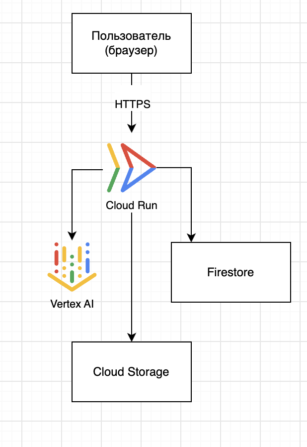
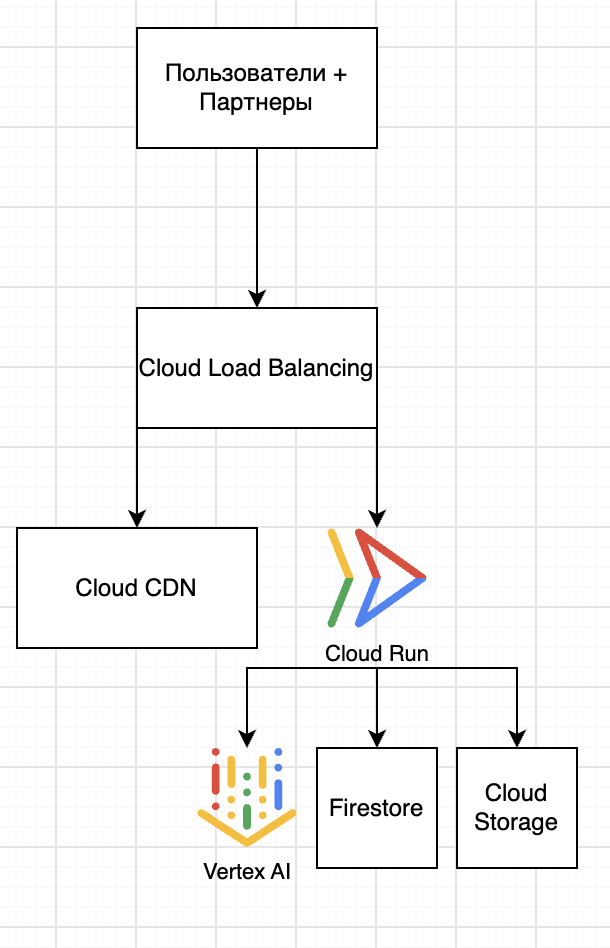
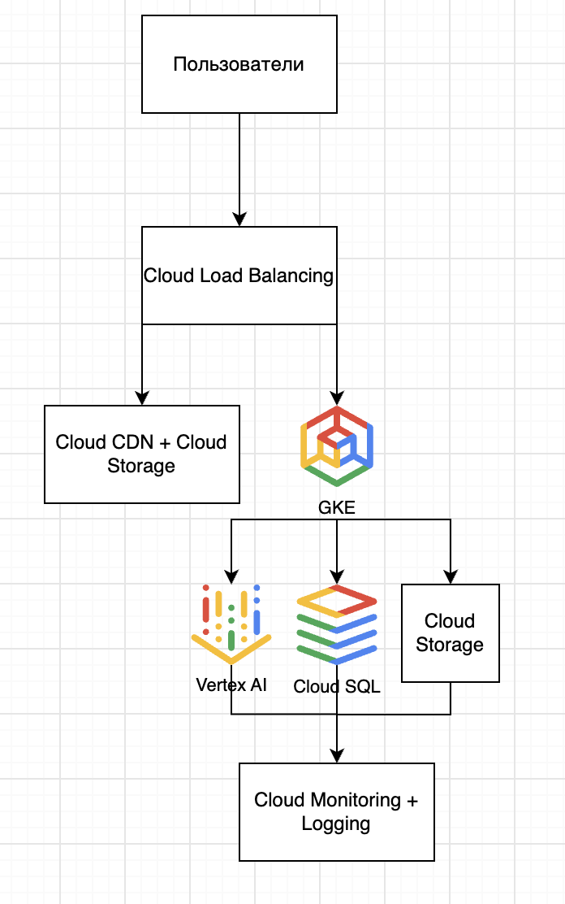

University: [ITMO University](https://itmo.ru/ru/)
Faculty: [FICT](https://fict.itmo.ru)
Course: [Cloud platforms as the basis of technology entrepreneurship](https://ex-itmo-ict-faculty.github.io/cloud-platforms-as-the-basis-of-technology-entrepreneurship/)
Year: 2026
Group: u4225
Author: Тузовская Арина Сергеевна
Lab: Lab4
Date of create: 30.09.2026
Date of finished: 30.09.2026

## Цель работы

Создать прототип AI-приложения с базовой функциональностью: спроектировать инфраструктуру для трех состояний проекта, рассчитать экономическую модель и обосновать выбор облачных ресурсов.

## Концепция приложения

**AI-сервис для генерации описаний товаров для интернет-магазинов.**

- **Целевая аудитория:** владельцы небольших интернет-магазинов, которые хотят быстро создавать уникальные и привлекательные описания для сотен товаров.
- **Проблема:** ручное написание описаний занимает много времени и требует копирайтера.
- **Решение:** веб-приложение, в которое пользователь загружает фото товара и ключевые слова, а AI-модель генерирует готовое описание.
- **Основные функции MVP:**
  - Загрузка изображения и ключевых слов.
  - Генерация описания через AI-модель (Vertex AI / Gemini).
  - Отображение и сохранение результата.
  - История генераций.

## Схемы инфраструктуры

### 1. Начальное состояние (MVP)

**Используемые сервисы и обоснование:**

- **Cloud Run (Frontend + Backend, 1 vCPU, 256 MB)** - serverless-платформа, которая идеально подходит для MVP: не нужно управлять серверами, оплата идет только за фактические запросы, есть бесплатный тариф.
- **Vertex AI (Gemini API)** — управляемый AI-сервис, оплата по токенам. Не нужно разворачивать собственную модель, что критически важно на старте.
- **Firestore (Native mode)** — serverless NoSQL база данных с бесплатным тарифом. Хорошо подходит для простых данных о пользователях и истории генераций.
- **Cloud Storage** — объектное хранилище для загруженных фотографий товаров.

**Почему это оптимально на старте:** минимальные расходы, быстрый запуск, отсутствие необходимости администрировать серверы. Все сервисы масштабируются автоматически.

### 2. Тестирование партнерами

**Что меняется:**

- **Cloud Load Balancing** — распределяет трафик между сервисами и обеспечивает единую точку входа.
- **Cloud CDN** — кэширует статический контент (изображения, стили, скрипты) на серверах по всему миру, ускоряя загрузку для партнёров из разных регионов.
- **Cloud Run увеличен до 2 vCPU / 512 MB с автомасштабированием до 10 инстансов** — справляется с повышенной нагрузкой от партнеров.

**Почему это оптимально на этапе тестирования:** появляется больше пользователей, и одиночный Cloud Run уже может не справляться. Load Balancer + CDN снимают нагрузку и дают стабильную задержку.

### 3. Продакшн

**Что меняется:**

- **Frontend вынесен в Cloud Storage + Cloud CDN** — статический сайт быстрее и дешевле отдавать из CDN, чем генерировать на сервере.
- **Backend переехал на GKE Autopilot** — Google Kubernetes Engine дает больше гибкости: несколько подов, тонкое управление ресурсами, поддержка сложной логики и микросервисов. Для продакшна с большим количеством пользователей это предсказуемее и производительнее Cloud Run.
- **Cloud SQL for PostgreSQL** — реляционная база данных нужна для сложных запросов, аналитики, транзакций и отчётности. Firestore на этом этапе уже не хватает.
- **Vertex AI с выделенным endpoint** — гарантирует стабильную задержку и предсказуемую цену (нет «шумных соседей»).
- **Cloud Monitoring + Logging** — наблюдение за всеми компонентами системы: отслеживание ошибок, метрик производительности и алертов.

**Почему это оптимально для продакшна:** надежность, масштабируемость, точный контроль ресурсов, готовность к тысячам одновременных пользователей.

## Экономическая модель

Расчет приведен для трех сценариев с оценкой предполагаемой нагрузки и месячной стоимости инфраструктуры.

| Компонент | Начальное (MVP) | Тестирование партнерами | Продакшн |
| :--- | :--- | :--- | :--- |
| **Нагрузка** | ~100 запросов/день | ~10 000 запросов/день | ~1 000 000 запросов/день |
| **Backend** | Cloud Run (1 vCPU, 256 MB) **~$0.50/мес** | Cloud Run (2 vCPU, 512 MB, autoscale до 10) **~$15/мес** | GKE Autopilot (несколько подов) **~$150/мес** |
| **AI Service** | Vertex AI (Gemini Flash) **~$1/мес** | Vertex AI (Gemini Pro) **~$50/мес** | Vertex AI (Gemini Pro, выделенный endpoint) **~$500/мес** |
| **Database** | Firestore (в рамках бесплатного тарифа) **~$0** | Firestore **~$10/мес** | Cloud SQL for PostgreSQL **~$100/мес** |
| **Storage** | Cloud Storage (5 GB) **~$0.10/мес** | Cloud Storage (100 GB) **~$2/мес** | Cloud Storage (1 TB) **~$20/мес** |
| **Сеть / CDN** | — | Load Balancer + Cloud CDN **~$30/мес** | Load Balancer + Cloud CDN **~$100/мес** |
| **Мониторинг** | — | Cloud Monitoring (базовый) **~$5/мес** | Cloud Monitoring + Logging **~$30/мес** |
| **Итого в месяц** | **≈ $1.60** | **≈ $112** | **≈ $900** |

## Обоснование выбора ресурсов

**Почему Cloud Run, а не GKE на старте?**
Cloud Run — это serverless: платишь только за фактические запросы, масштабируется автоматически до нуля, когда нет трафика. На этапе MVP, когда нагрузка минимальна, это идеально. GKE требует постоянно работающих узлов, что даёт ненужные расходы при малой нагрузке.

**Почему GKE, а не Cloud Run в продакшне?**
При миллионе запросов в день становится важна тонкая настройка ресурсов, разделение на микросервисы, кэширование, планирование задач. GKE Autopilot дает контроль над каждым подом, поддерживает сложные сценарии (воркеры, фоновые задачи, очередь) и обеспечивает предсказуемую производительность.

**Почему Firestore → Cloud SQL?**
Firestore — NoSQL база, отлично подходит для быстрого старта. Но для аналитики, сложных JOIN-запросов, транзакций и отчетности нужна реляционная база. Cloud SQL for PostgreSQL — стандарт индустрии.

**Почему Vertex AI, а не своя модель?**
Разворачивать собственную AI-модель на GPU стоит десятки тысяч долларов в месяц и требует команды ML-инженеров. Vertex AI — управляемый сервис: платишь только за использование, получаешь доступ к лучшим моделям Google (Gemini).

**Почему CDN нужен уже на этапе партнеров?**
Статика — это картинки, стили, JS. Если их отдавать напрямую с сервера, каждый запрос тратит ресурсы Cloud Run. CDN кэширует их ближе к пользователю и снимает нагрузку с бэкенда.

## Вывод

В ходе лабораторной работы я спроектировала инфраструктуру AI-приложения для трех этапов его жизненного цикла: MVP, тестирование партнерами и продакшн. Для каждого этапа были подобраны подходящие облачные сервисы Google Cloud и рассчитана примерная стоимость содержания инфраструктуры.

**Ключевой вывод:** выбор облачных ресурсов должен быть стратегическим и учитывать будущий рост нагрузки. Самое дешевое решение на старте (Cloud Run + Firestore) не всегда оптимально в дальнейшем — при росте нагрузки приходится переходить на GKE и Cloud SQL. Однако и переплачивать за продакшн-архитектуру с самого начала нерационально: вложения не окупятся, пока продукт не доказал свою востребованность.

Правильная стратегия — **постепенное масштабирование** инфраструктуры вслед за ростом продукта: начать с MVP на serverless-решениях, усилить систему на этапе тестирования партнерами (Load Balancer + CDN), а на продакшне перейти к более производительным и управляемым сервисам (GKE, Cloud SQL, выделенный Vertex AI endpoint).
